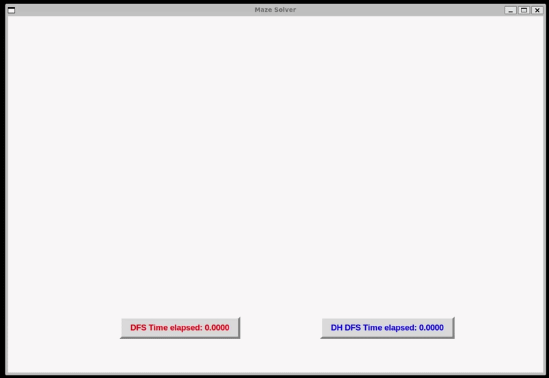

# Maze solver
Maze Solver is a Python application that generates and solves random mazes using Depth-First Search (DFS). The project began as a guided Boot.dev assignment before being extended to compare multiple maze-solving strategies through real-time visualisation and performance metrics.

## Technical Highlights
- Recursive algorithm implementation using Depth-First Search
- Comparative visualisation of multiple solving strategies
- Real-time performance metrics integrated into the animation loop
- State management across Maze and Window classes
- Object-oriented GUI architecture

## Tech Stack
- Python
- tkinter
- unittest

## Demo
### Maze Solver Demonstration

Demonstration comparing the DFS and Directional Heuristic DFS algorithms with live performance timers.



## Quick Start
### Clone the Repository
```bash
git clone https://github.com/ajrollerson/mazesolver
cd mazesolver
```

### Run the Test Suite
```bash
python3 tests.py
```

### Run the Application
```bash
python3 main.py
```

## Key Features
### Core Functionality
- Generate random mazes
- Solve mazes using Depth-First Search
- Validate core functionality with automated tests

### Independent Extensions
- Implemented a Directional Heuristic DFS (DH DFS) algorithm
- Integrated independent timing systems into the graphical simulation

## Design Choices
### Real-Time Performance Visualisation
Two independently timed solvers were displayed simultaneously to enable immediate visual comparison between algorithms. Although resetting the maze between runs was considered, doing so would have significantly increased the scope of the project while providing less direct comparison.

### Directional Heuristic DFS algorithm (DH DFS)
Initially attempted to implement a right-hand-rule heuristic. Investigation revealed that a simple wall-following approach was insufficient within the existing recursive architecture, leading to the development of the Directional Heuristic DFS approach.

During development of the directional heuristic solver, significant debugging was required to diagnose infinite loops and oscillation between cells. Substantial logging and tracing were used to identify problematic traversal behaviour, leading to the introduction of direction-based state to prevent oscillation and guide traversal decisions.

### Algorithm Behaviour
In most randomly generated mazes, the standard DFS algorithm outperforms the Directional Heuristic DFS algorithm. The heuristic performs best when the maze layout aligns with its traversal priorities and contains relatively few competing branches.

## Known Limitations
- Some timer positions and graphical elements are currently hardcoded.
- Automated test coverage is currently limited and does not include the maze-solving algorithms.

## Future Improvements
- Expand the testing suite to validate algorithm behaviour and performance.
- Refactor the DH DFS algorithm to reduce verbosity and improve maintainability.
- Implement additional maze-solving algorithms for broader performance comparison.
